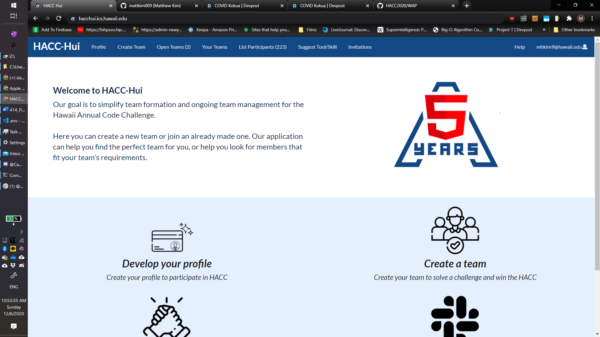
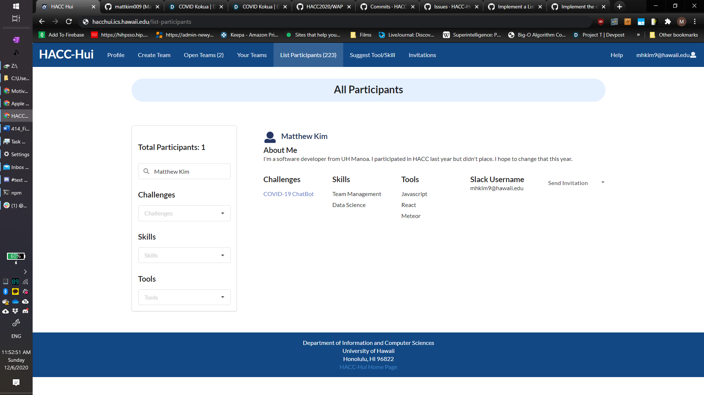
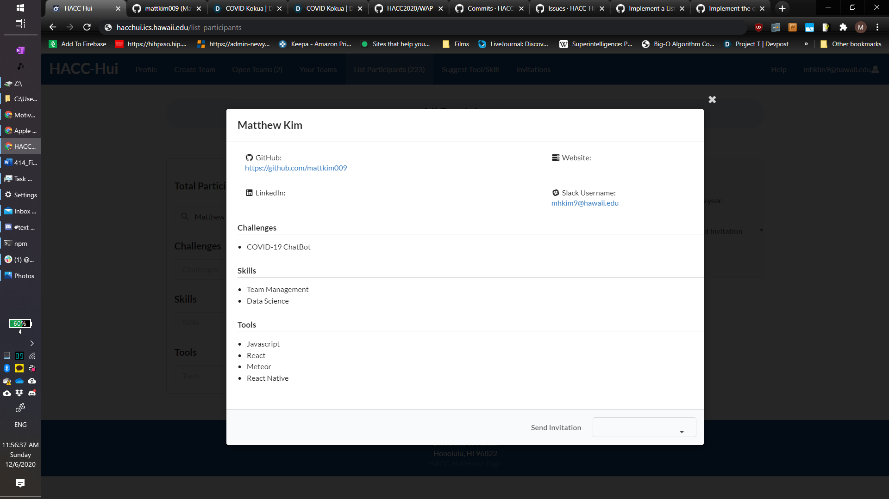
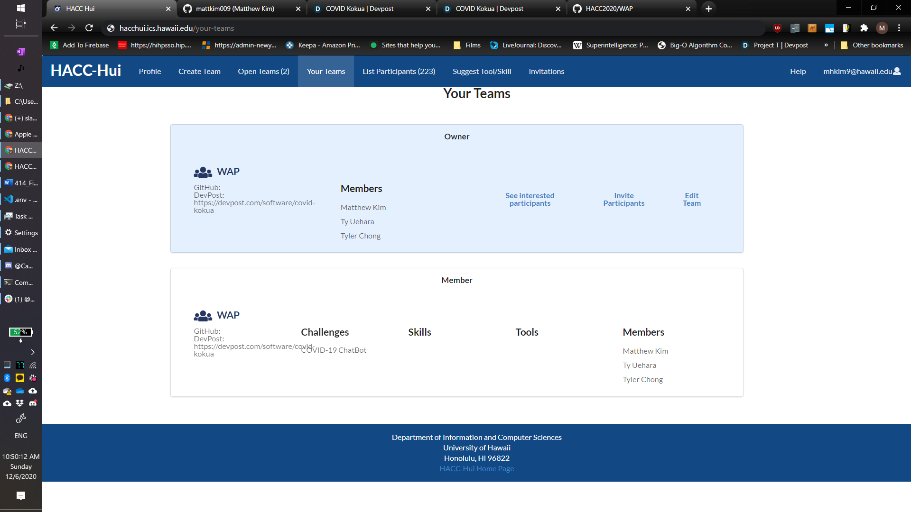
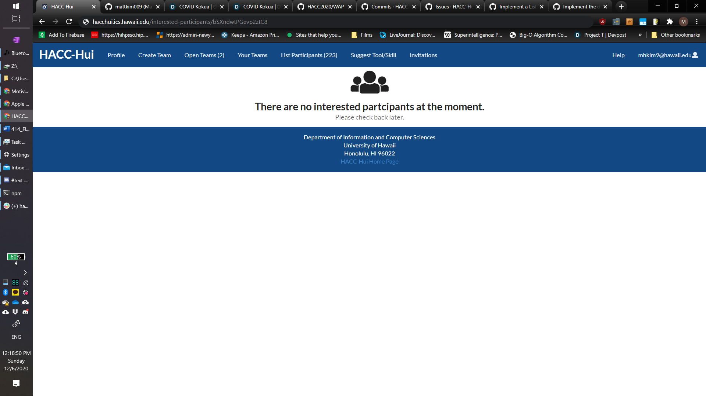

Aloha! From August 2020 to October 2020, I helped create a website called HACC-Hui for a college course (ICS 414).  This website was created to formalize the team formation process for the Hawaii Annual Code Challenge (HACC).  HACC is the largest hackathon in Hawaii with over 200 participants and staff members.  Originally, all participants registered for the HACC in-person on the day it started.  On this day participants were able to meet other participants in-person to find potential teammates.  Unfortunately, this is not a viable way for participants to find teammates during the times of a hard-hitting pandemic and HACC was pushed to go fully online this year.  Therefore, our class set out to create a website that allowed participants to create a profile, find teammates, and create teams.  Administrator roles were also created so that the HACC staff can manage these teams and participants.  

I worked on a lot of things but my work on the List Participants page and the Interested Participants page is what made it to the final product.  The List Participants page shows a listing of all the participants.  Users can filter these results based on challenges, skills, and tools.  They can also type in a name to find a participant (as shown in the picture above).  Each participant listing/card shows the participant’s name, a section about themselves, the challenges they are interested in, the skills and tools they are proficient in, their slack username, and an option to invite them to invite that participant to the user’s team.  

If the user would like to see the rest of the participant’s profile, they can click on the listing which will open a modal detailing the rest of the info.  I worked with Ch	ristine Uehara on this page.  A basic layout of this page already existed so we refined it and added things.  I got the filter feature to correctly filter the participants and cleaned up the UI of each listing.

The Interested Participants page shows which participants are interested in joining a user’s team. A participant can express interest in a team by finding a team on the Open Teams page and then hitting the Request to Join button on that team’s listing.  A slack message will then be sent to the team’s owner showing the name of the participant and the team they are interested in joining.  The team owner can accept or decline this request by on the Interested Participants Page.  They can reach this by, first, going to the Your Teams page and then clicking on the See Interested Participants category on the team listing.  

  
  

I worked with Kason Shiroma on page.  I was responsible for implementing the functionality for the Request to Join button including the sending of the slack message and cleaning up the UI for the Interested Participants page.

This was the first time ICS 414 had been run like this, so it was a learning process for we, the students, and the professor.  This was the first time the professor taught a course like this, so he had to create a plan and then change it up to accommodate for any unexpected events.  Originally, we worked in separate teams of 4-5 students but merging changes from 5 teams took longer than expected and slowed down progress.  Also, some of the HACC staff were not available to help us during the first few weeks of this project so we went in slightly blind.  When they did give us feedback a month in, they mentioned to a lot of changes which pushed us back even further.  Therefore, in the final weeks before the HACC kickoff, we ditched the team idea and directly worked on the main repo together.  We did not have time to review each other’s code which caused a lot of issues because students were pushing broken code and the professor had to fix the master branch almost every other day until HACC started.  Despite the frustrations, I learned a lot about working in a team and why communication is necessary to keep us on the same page.  I also learned a lot about why tests and linting are important and am glad to have gotten more practice on that.

