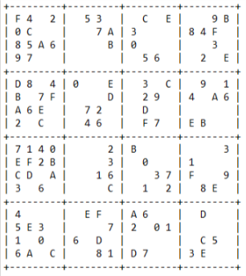

<div class="ui small rounded images">
  
  
</div>

Micromouse is an event where small robot “mice” solve a 16 x 16 maze. ...

```java
  public static int[][] recursiveSolver(int[][] sudoku, ArrayList<Integer> legalVals, 
      int row, int column) {
    numOfRecursionCalls++;    
    if (legalVals == null) {
      if (column == 15) {
        if (row == 15) {
          return sudoku;
        } else {
          return recursiveSolver(sudoku, legalValues(sudoku, row + 1, 0), row + 1, 0);
        }
      } else {
        return recursiveSolver(sudoku, legalValues(sudoku, row, column + 1), row, column + 1);
      }
    } else {
      for (int i = 0; i < legalVals.size(); i++) {
        numOfIterations++;
        sudoku[row][column] = legalVals.get(i);
        if (column == 15) {
          if (row == 15) {
            return sudoku;
          }
          recursiveSolver(sudoku, legalValues(sudoku, row + 1, 0), row + 1, 0);
        } else {
          recursiveSolver(sudoku, legalValues(sudoku, row, column + 1), row, column + 1);
        }
        if (checkSudoku(sudoku, true) && noEmpty(sudoku)) {
          return sudoku;
        }
      } 
      sudoku[row][column] = -1;
      return sudoku;
    }
  }
```

You can learn more about the assignment [here](http://courses.ics.hawaii.edu/ics211s18-1/morea/110.recursion/experience-H08.html) and view my code [here](https://github.com/mattkim009/Hexadecimal-Sudoku)


