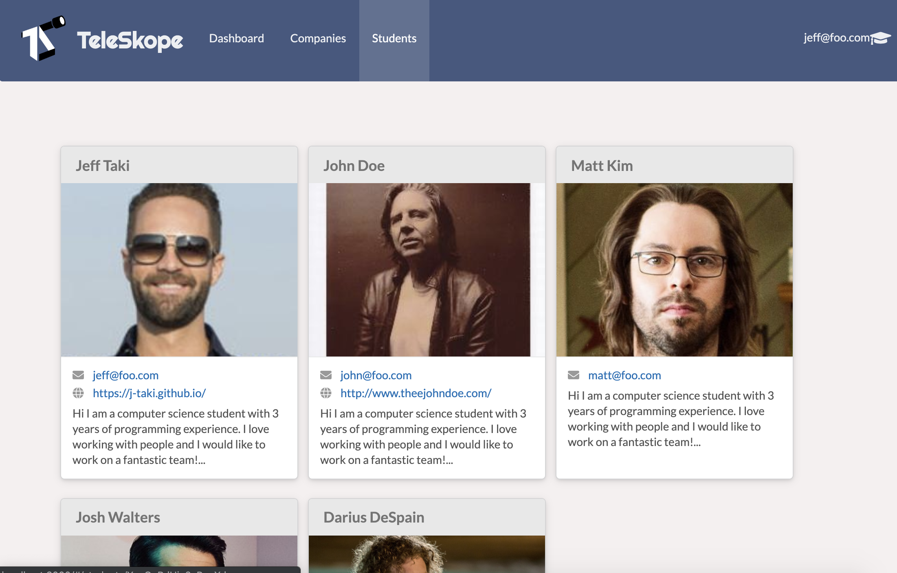
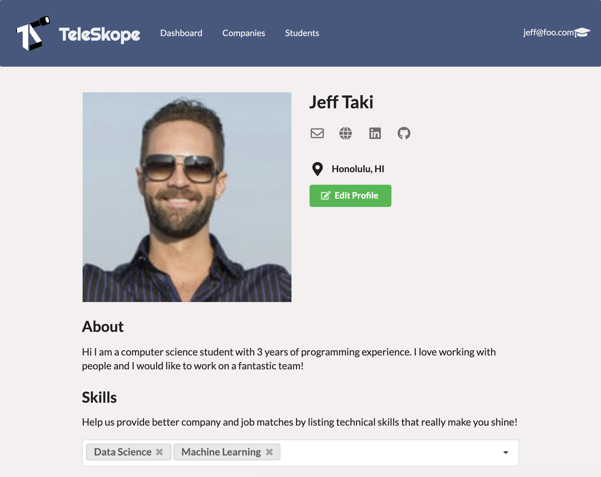
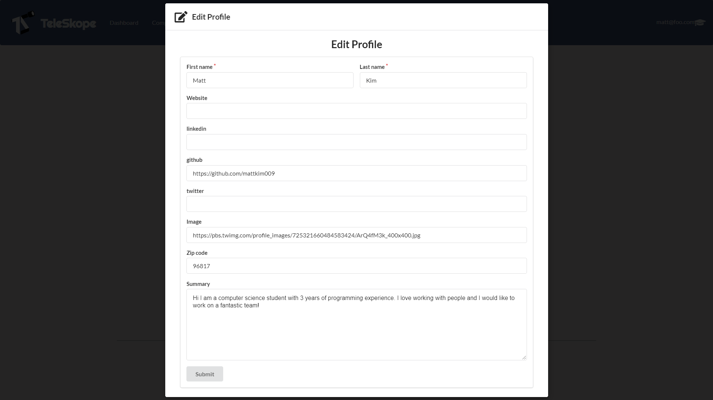

<div class="ui medium centered rounded images">
  
</div>

## What is Teleskope?
Teleskope is an app that connects students to companies for job opportunities.  We match students to companies based on the student's skills and the skills needed for the company's jobs to ensure the best fit for each other.  When finding a company a they like students can follow that company, where they will recieve updates from regarding the company's doings on the site.  We used Semantic UI and React to support the front-end, MongoDB to manage the data, and Meteor as the foundation.

## My Contributions
The bulk of my work was on the front-end where I helped create the landing page, navigation bar, student index page, student card component, profile page, and edit profile component.  
<div class="ui medium centered rounded images">
  
  
  
</div>

Behind the scenes I made sure the student registration and company registration created the profiles and companies properly by modifying the functions that created the student and company.  I learned the most about the back-end when creating the edit profile page.  When

<!---
```js
byte ADCRead(byte ch)
{
    word value;
    ADC1SC1 = ch;
    while (ADC1SC1_COCO != 1)
    {   // wait until ADC conversion is completed   
    }
    return ADC1RL;  // lower 8-bit value out of 10-bit data from the ADC
}
```
--->
