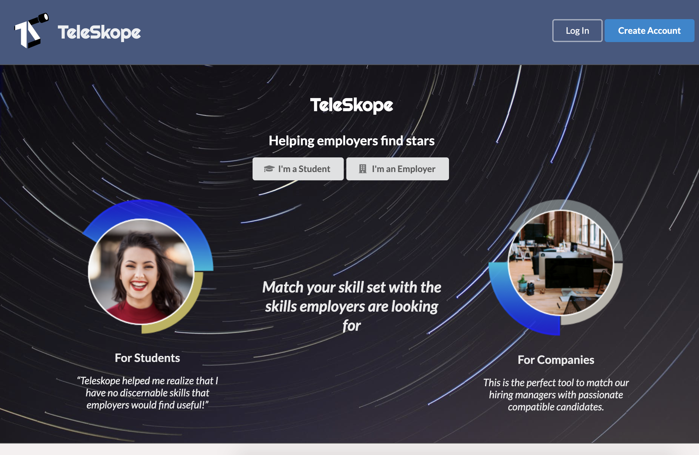

<div class="ui medium centered rounded images">
  
</div>

# What is Teleskope?
Teleskope is an app that connects students to companies for job opportunities.  

<!---
```js
byte ADCRead(byte ch)
{
    word value;
    ADC1SC1 = ch;
    while (ADC1SC1_COCO != 1)
    {   // wait until ADC conversion is completed   
    }
    return ADC1RL;  // lower 8-bit value out of 10-bit data from the ADC
}
```
--->
